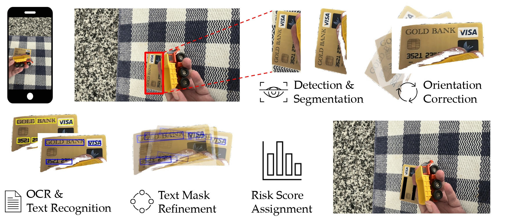

<div align="center">
<h2> [COLM2025] Beyond Blanket Masking: Examining Granularity for Privacy
Protection in Images Captured by Blind and Low Vision Users </h2>

Jeffri Murrugarra-Llerena<sup>1</sup>, Haoran Niu<sup>2</sup>, K. Suzanne Barber<sup>2</sup>, Hal Daumé III<sup>3</sup>, Yang Trista Cao<sup>2</sup>, Paola Cascante-Bonilla<sup>1,</sup><sup>3</sup>

<sup>1</sup> State University of New York at Stony Brook&nbsp; <sup>2</sup>  University of Texas at Austin&nbsp; <sup>3</sup> University of Maryland, College Park

</div>

[[`Paper`]()] [[`Project`](https://artcs1.github.io/VLMPrivacy/)] [[`BibTeX`](#citation)]

## About



VLM - Privacy can detect both coarse and fine-grained information. Also, based on some external information it can select which detection are more critical than others.

## Install

1. Create a conda enviorenment

```
conda create --name py10-vlm python=3.10
conda activate py10-vlm
```
2. Install the following package

```
pip install --upgrade git+https://github.com/huggingface/transformers accelerate
pip install -U flash-attn --no-build-isolation
pip install qwen-vl-utils[decord]
python -m pip install paddlepaddle==3.0.0rc1 -i https://www.paddlepaddle.org.cn/packages/stable/cpu/
```
3. Install the requirements.txt

```
pip install -r requirements.txt
```

4. Download external models (PaddleOCR)
   
```
!wget https://paddleocr.bj.bcebos.com/dygraph_v2.0/pgnet/e2e_server_pgnetA_infer.tar && tar xf e2e_server_pgnetA_infer.tar
```

## Demo

We show how to use our agents and their interactions in demo.ipynb

## Code for validation experiments

1. Compute detections
```
python3 vizwiz_priv_ann.py
```
2. Compute the labels
```
python3 vizwiz_priv_ann_label.py
```
3.  Compute locations
```
python3 vizwiz_priv_ann_locations.py
```  
4.  Compute metalabels
```
python3 vizwiz_priv_ann_metalabel.py
```
5.  Run the evaluations
```
python3 vizwiz_vqa_all_fixed_object.py
```
6.  Compute the statistics
```
python3 vizwiz_process_statistics.py
```


## Citation

If you use this model in your research, please consider citing:

```
@article{Murrugarra_2025_colm,
  author    = {Murrugarra-Llerena, Jeffri and Haoran, Niu and K.Suzanne, Barber and Daume III, Hal and Trista Cao, Yang and Cascante-Bonilla, Paola},
  title     = {Beyond Blanket Masking: Examining Granularity for Privac Protection in Images Captured by Blind and Low Vision Users},
  journal   = {COLM},
  year      = {2025},
}
```
